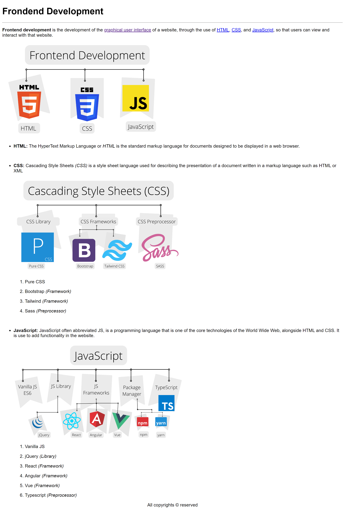

# PROJECT 2: Front-End Road Map in HTML
Complete Front End Development by **Anurag Singh Sir**

Reference Video:

>[Youtube Playlist Link](https://www.youtube.com/playlist?list=PLfEr2kn3s-br9ZFmejfLhAgMbGgbpdof8) | [Anurag Portfolio Website](https://anuragsinghbam.com/)

> *Google karna seklo, Web Development apna aap ajayega* -Anurag Singh

RoadMap HTML Project :point_right:
Project Design :art::paintbrush:
 
[Project Link](https://02-html-roadmap--trishulnaik-frontend-anuragsir.netlify.app/) :wrench:

## Things Learnt
- Why we name file as index.html?
- HTML Tags
  - Give a paragraph
  - break a sentence into new line in a paragraph
  - Make text bold and italic 
  - Add a link (open in new tab when clicked)
  - Reason of color change after clicking link, hovering link.
  - Display bullet points.
  - Ordered vs Unordered List?
  - Ordered list (style, start attributes)
  - HTML entities 
    - Copywrite &copy; symbol
    - non breaking space
    - multiply symbol &times;
  - Inline vs Block elements?
  - Inline style in HTML element
  - span vs div element?
  - Semantic HTML. Why we use it?
  - strong vs b and em vs i ?
  - Tag vs Element in HTML?
  - Element specific vs Global vs Custom attribute?
  - class, id, title, style, src, alt - attributes
  
## Extra Resources
- Project Resource Link :point_right: [Link](https://www.youtube.com/redirect?event=video_description&redir_token=QUFFLUhqbDk4bVNsYlRwQ2hXZ3ZvM3NtQ3ZvbnZxeTVnZ3xBQ3Jtc0ttQzlEdUNIbUo4RW9NNTVSMWRTVzR3eGs3dHplekNxX3FMczlEYlNxMVQ0RWFLSkJWVk45NkNjNjBYNnZXSDZ0VEZqWXk4OFlQSUl6WlBjVUdwTnhkNk1MZHZ0VnFWTmgxdXBqRmlJanowaFZvZjlSMA&q=https%3A%2F%2Fcodeload.github.com%2Fprocodrr%2Ffrontend-roadmap%2Fzip%2Frefs%2Fheads%2Fmain&v=1dWQssiqKvQ)
- Websites with only HTML :point_right: 
  - **First Website**: https://info.cern.ch/
  - **Professor Thomas H. Cormen** Portfolio: https://www.cs.dartmouth.edu/~thc/
  - **Professor Jon Kleinberg** Portfolio: https://www.cs.cornell.edu/home/kleinber/
  - **Professor Donald E. Knuth** Portfolio: https://www-cs-faculty.stanford.edu/~knuth/
- W3Schools (HTML): https://www.w3schools.com/html/default.asp
- MDN (HTML reference): https://developer.mozilla.org/en-US/docs/Web/HTML/Element 

>[!CAUTION]
> You don't need **Auto Rename Tag** VSCode Extension anymore :point_right: [BLOG: https://www.roboleary.net/vscode/2020/08/05/dont-need-extensions.html](https://www.roboleary.net/vscode/2020/08/05/dont-need-extensions.html)
  
## Tools and Extesions Used
- IDE - [VS Code](https://code.visualstudio.com/)
- Extensions - 
  - [Live server](https://marketplace.visualstudio.com/items?itemName=ritwickdey.LiveServer)
  - [Prettier](https://marketplace.visualstudio.com/items?itemName=esbenp.prettier-vscode)
  - [Auto Rename Tag](https://marketplace.visualstudio.com/items?itemName=formulahendry.auto-rename-tag)

